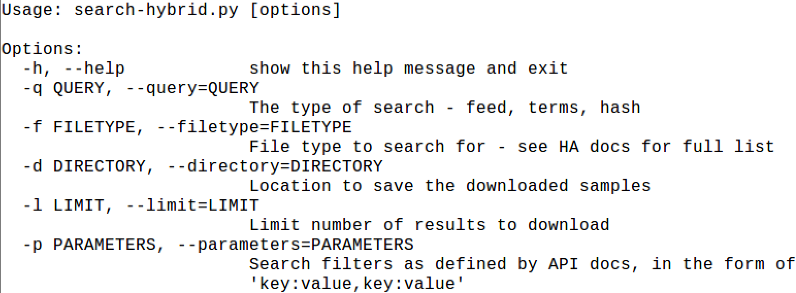

# Hybrid Analysis API v2 - Search and Download
This is a small Python3 script that allows you to search and download samples from Hybrid Analysis' v2 API. Functionality is based off of HA documentation for the API at [https://www.hybrid-analysis.com/docs/api/v2](https://www.hybrid-analysis.com/docs/api/v2).

This script does not attempt to implement all of the APIs functionality, but rather is focused on finding and downloading samples. This could be useful in developing an automated pipeline of analysis. 

## Getting Started

This script requires Python3 and you'll need to obtain an API key from [Hybrid-Analysis](https://www.hybrid-analysis.com/docs/api/v2#/). Help is built in. Please keep in mind that the primary purpose of this script is to download malware.

## Finding Malicious Samples

Currently, this scirpt allows for searching via [search terms](https://www.hybrid-analysis.com/docs/api/v2#/Search/post_search_terms). Only a few of the parameters have been explicitly defined - such as *filetype* - as I tend to use this parameter on a regular basis. The script also allows for flexible input of all other parameters through the *-p* argument, which accepts a string of key/value pairs seperated by a comma. For example:

> -p vx_family:emotet,filename:invoice.doc,tag:ransomware

In addition, the script will pull from the the latest [feed](https://www.hybrid-analysis.com/docs/api/v2#/Feed/get_feed_latest). This is a listing of 250 samples from the previous 24 hour period. There is a boolean field return in the JSON feed that indicates if the sample is "interesting". In the case that it is, it is downloaded. What constitutes interesting is still a little unclear to me.

## Downloading Malware

Once samples have been identified for download, the script will download them as GZIP file and save it to the desired directory. Please keep in mind that you may encounter limitations based on your level of access. This script attempts to throttle the frequency at which downloads are made along with limiting the total number of downloads.

## Future Work

Right now this is a minimal implementation that focused on my immediate need to obtain malware samples, my intention is to continue to expand upon it's capability. Of course, pull requests/etc are all welcome :)